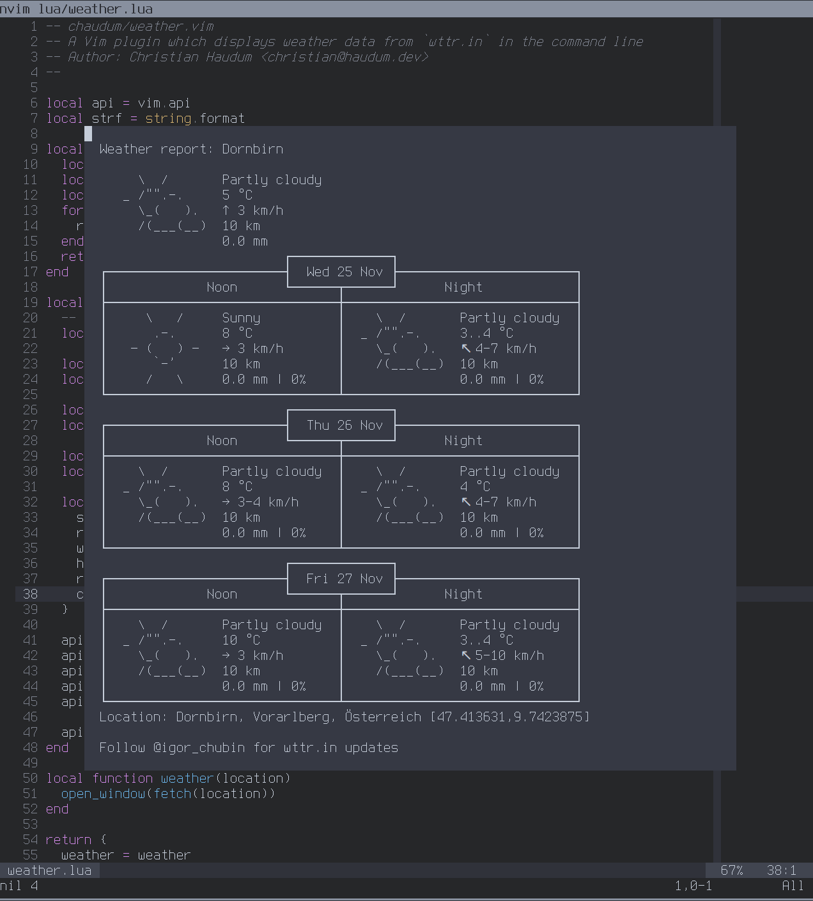

# wttr.vim

A Vim plugin that displays data from http://wttr.in inside your favourite editor.

---



## Installation

### Via plugin manager

Using [vim-plug](https://github.com/junegunn/vim-plug) for example, add this
repository to your list of plugins:

```
Plug 'chaudum/wttr.vim'
```

Then run `:PlugInstall`.

### Manually

Download the repository and put the files `plugins/wttr.vim` and `lua/wttr.lua`
into their respective folders of your vim installation.

## Usage

```
:Wttr [Location]
```

Example:

```
:Wttr Vienna
```
